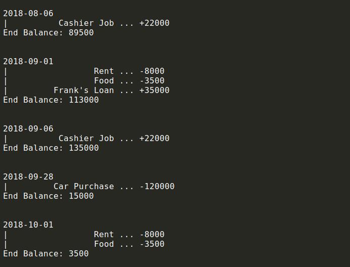
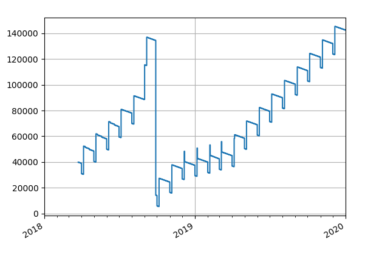

# ProFin - Personal Finance Projector

```
                         __
      o                 /' ) 
                      /'   (                          ,
                  __/' PRO )                        .' `;
   o      _.-~~~~'          ``---..__             .'   ;
     _.--'   b)                      ``--...____.'   .'
    (     _.      )).      `-._                     <
     `vvvvvvv-)-.....___.-     `-.         __...--'-.'.
       `^^^^^'-------.....`-.___.'----... .'         `.;
                                  jgs    `-`           `
```

ProFin is a python module for projecting the balance of a personal savings account 
over a future period.

The output can be used to visualise the balance development when planning some big
purchase or a change of the living situation, such as buying a flat or a car, 
getting a new job with possible months of no income, etc.

Please note the script is intended only for orientation and there may be minor
inaccuracies or bugs (please report!)

## Supported Features

### Financial Operations & Schemes

- Once-off expenses and income
- Recurrent monthly payments / income at a fixed date
- Monthly payments with a total expense cap
- Skipping a month in monthly payments / income
- Spread monthly expenses (e.g. food cost) - distributed over all days in a month
- Simple loan (borrowing money from a friend) with back-payments
- Setting initial or correction balance

### Functions

- Setting up a financial situation with changes at arbitrary dates
- Simulating account balance with day granularity
- Plotting results using PyPlot

**Example with Betty's car purchase**



*(note: spreading was switched off for a more readable display here, so the values are slightly different from the graph below which has spreading enabled)*



## Dependencies

The script uses NumPy, MatPlotLib and Pandas for plotting. This may be improved in a future version
(in particular Pandas could be replaced). 

If plotting is not needed and the dependencies are not available (e.g. some old Debian), 
remove their imports and comment out the graph() function

## Examples

See the example files for an example of usage. (The examples are silly and not very representative, but they show the API well).
Additionally the code is documented with doc comments.

### Usage example

ProFin is used by writing a configuration script in Python. First create the projector:

```python
import profin

pf = profin.Projector()
```

Now set the initial balance and the start date. This is the start of the simulation, which is done day by day. 
This is a fluent API, date() returns self.

```python
pf.date(2018, 'March', 24).balance(+40_000)
```

The next part is setting up recurrent and once-off expenses and incomes and their changes. This will be
better explained below. The last bit is where we run the simulation:

```python
samples = pf.project_to(2019)

pf.graph(samples)
```

samples is an array of record when the abalnce changed that we cna plot using the graph() method.

## API overview

ProFin works with two types of objects: the profiler, and incomes. Expense is a negative income and is internally 
represented the same way.

Generally all methods return the object itself for easy chaining, with the exception of Projector methods like `monthly`, `single` etc,
which are shortcuts for creating income instances.

### Projector API

- `pf.date(year, month, day)` - set time cursor. This is used for subsequently created incomes as a starting date, or
  for their `.start()` and `.end()` methods when used without arguments. Day is optional and defaults to 1

- `pf.project_to(year, month, day, verbose)` - Run the simulation. month, day and verbose are optional, `month` and `day`
  are by default Dec 31, `verbose` is True. `verbose` defines if we want to show updates in stdout when simulating. Returns a array of `samples` for plotting.
  
- `pf.graph(samples, currency)` - draw samples from `project_to()` using pyplot. Currency is appended to values for display only

- `pf.balance(money)` - set balance. when called in places other than at the beginning, this resets the balance at the given date resulting in a
 sharp change in the graph.

- `pf.monthly(name, income, day=1)` - define a monthly income or expense of monthly value `income`, paid on day `day`.
  This returns a MonthlyIncome object. Name describes the income / expense in the stdout log.

- `pf.single(name, money)` - once-off income or expense, returns a `SingleIncome`.
- `pf.expend(name, money)`, `pf.receive(name, money)` - aliases of `single` that also ensure the money value has the right sign

- `pf.borrow(name, money)` - describes a received interestless loan, returns a `SimpleLoan`.

### MonthlyIncome API

- `mi.on(day)` - set the pay day in the month
- `mi.skip_month(year, month)` - skip a month's payment
- `mi.start(year, month, day)` - set start date (month, day default to Jan 1)
  If no args given, take current cursor's date
- `mi.end(year, month, day)` - end the payments. If no args given, take last day of current cursor's month
- `mi.total(total)` - set a total money cap, after it's exhausted the payments stop
- `mi.spread(yes=True)` - enable or disable spreading. This distributes the price across the month's days for a more realistic graph in some cases

### SingleIncome API

- `si.on(year, month, day)` - set the date of the payment, default - use cursor's date. month and day default to Jan 1

### SimpleLoan API

This is a composite income that is made up of a SingleIncome and a MonthlyIncome with a
negative total and per_month.

- `loan.on(year, month, day)` - set reception date, month and day are optional, default to Jan 1
- `loan.repay_monthly(payment, day)` - specify monthly repayments on a given day
- `loan.begin(year, month)` - set start month for repayments
